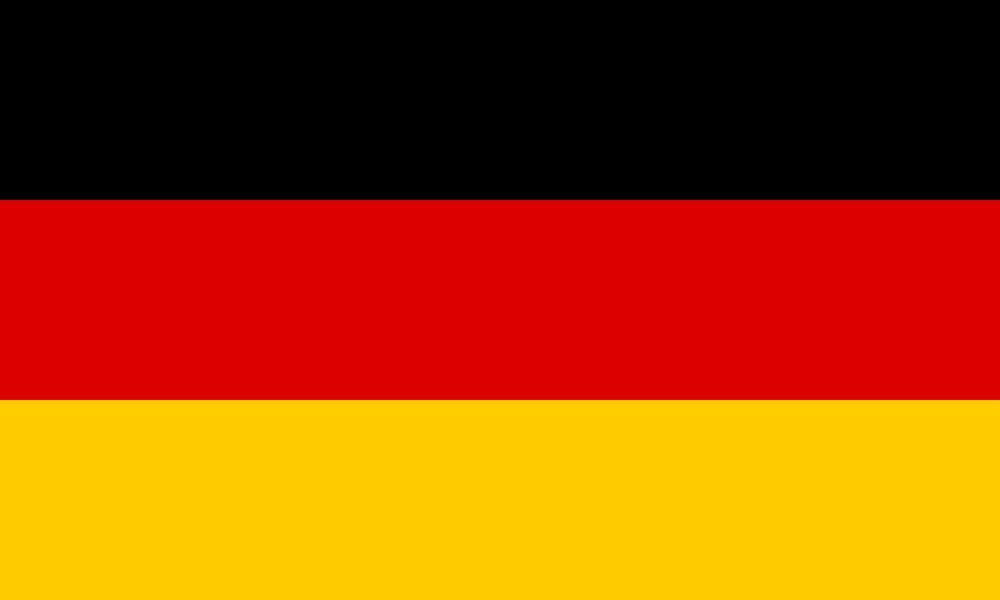

# 👋 Willkommen!

---

---

A compact, well-organized reference for learners of German. This site collects concise grammar notes, vocabulary lists by topic, practice material, and curated resources — designed for quick lookup and revision.

---

## 📋 Overview

- 🔤 [Alphabet](alphabet/README.md)
  Learn the German alphabet, sounds, and special characters (ä, ö, ü, ß).
- 📖 [Grammar](grammar/README.md)
  Covers the core building blocks: articles, nouns, verbs, adjectives, pronouns, syntax, and more.
- 📘 [Vocabulary](vocabulary/README.md)
  Themed word lists for everyday life: people, travel, work, food, technology, politics, and beyond.
- 📝 [Exam](exam/README.md)
  Exercises, translations, sample texts, and exam preparation materials for listening, reading, writing and speaking.
- 🪪 [Citizenship](citizenship/README.md)
  German history, politics, and society — useful for integration courses and official tests.
- 🔗 [Resources](resources/README.md)
  External references, tools, and further study materials.

---

## 📜 Brief History

German is a **West Germanic language** with roots stretching back to **Proto-Germanic**, the ancestor of languages like English, Dutch, and Swedish. Its development is commonly divided into key historical periods:

* **Old High German (c. 750–1050 AD):** This period began after the **Second Germanic Sound Shift**, resulting in different regional dialects but no standardized written form.
* **Middle High German (c. 1050–1350 AD):** A time of literary flourishing, characterized by epic poetry and courtly romances.
* **Early New High German (c. 1350–1650 AD):** The language began to unify, largely due to **Martin Luther's translation of the Bible (1522)**. His use of a readily understood East Central German dialect was crucial in establishing the basis for today's standardized written language, known as **Standard German** or *Hochdeutsch* (High German).

Today, German is a major global language, holding the distinction of being the most widely spoken native language within the European Union.

---

## 🌍 German speaking countries

German is an **official language** in six European countries, forming the core of the German-speaking world:

| Country | Status |
| :--- | :--- |
| 🇩🇪 **Germany** | Official |
| 🇦🇹 **Austria** | Official |
| 🇱🇮 **Liechtenstein** | Official |
| 🇨🇭 **Switzerland** ❤️ | Co-Official (along with French and Italian) |
| 🇱🇺 **Luxembourg** | Co-Official (along with French and Luxembourgish) |
| 🇧🇪 **Belgium** | Co-Official (German-speaking Community) |

It also holds recognized regional or minority language status in several other countries, including **Italy (South Tyrol)**, **Poland**, and **Denmark**.

Significant German-speaking **minority communities** exist outside of Europe, largely due to emigration over the centuries. The largest communities are found in the **United States**, **Canada**, **Brazil**, and **Argentina**.

---

## ❗ Notes

✨ This is a personal project, created and maintained by me.
⚠️ While I strive for accuracy, mistakes may exist.
💡 Help, corrections, and feedback are always very welcome!

---

## ⚖️ License
This project is licensed under the Creative Commons Attribution-NonCommercial-ShareAlike 4.0 International License (CC BY-NC-SA 4.0).
See the [LICENSE](https://github.com/Tsimpliarakis/German-Cheat-Sheet/?tab=License-1-ov-file#readme) file for details.

---