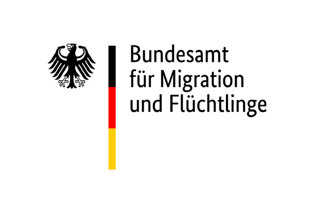

# 📝 German Naturalization Test (Einbürgerungstest)

---

---

The **Einbürgerungstest** is an official examination for people who want to become German citizens. It tests knowledge about **Germany’s legal system, society, and living conditions**, as well as **history and culture**. Passing the test is a requirement for most applicants seeking naturalization in Germany.

---

## **🎯 Purpose**

The test ensures that immigrants understand the basics of life in Germany, including:

* ⚖️ Democratic principles
* 🛡️ Rights and responsibilities of citizens
* 📜 German history and culture
* 🏛️ Political and social systems

It promotes integration and helps new citizens participate actively in German society. 🤝

---

## **📊 Structure**

* The test consists of **33 multiple-choice questions** ❓
* Questions are drawn from a set of **310 official questions** provided by the Federal Office for Migration and Refugees (BAMF) 📚
* To pass, you must answer at least **17 out of 33 questions correctly** (≈51% correct) ✅
* The questions cover both **general topics** and **state-specific topics** (Bundesland-specific) 🏞️

---

## **📚 Topics Covered**

### 1. **🏛️ Politics and Democracy**

* ⚖️ Basic principles of the German constitution (Grundgesetz)
* 🛡️ Rights and duties of citizens
* 🏢 Federal government structure, Bundestag, Bundesrat
* 🗳️ Political parties and their roles

### 2. **🕰️ History and Responsibility**

* 📜 Key historical events in Germany (e.g., Weimar Republic, Nazi era, World Wars)
* ✌️ Post-war Germany and reunification
* 🌍 Germany in the EU and international relations

### 3. **🏠 Society and Living in Germany** 

* 🏥🎓 Social security system, healthcare, and education
* ⚖️🚓 Law and order, justice system
* ☕🎉 Everyday life and cultural norms
* 🌱♻️ Environmental awareness and sustainability

### 4. **🗺️ State-Specific Questions** 

* 🏰 Each Bundesland has **10 additional questions** specific to its history, culture, and government 
* ❓ Applicants answer 3 of these questions during the test, only for the state that they are registered.

---

## **👤 Who Takes the Test**

* Immigrants seeking German citizenship, usually after **8 years of legal residence** 🏠 (can be shorter under certain circumstances)
* Exemptions exist for people with certain disabilities or insufficient language skills ♿🗣️

---

## **📖 Preparation**

* BAMF provides a **question catalog** online 💻
* Preparation courses are offered by adult education centers (Volkshochschulen) 🏫 and integration courses
* Many applicants use practice tests to familiarize themselves with the format 📝

---

## **✅ After the Test**

* If you pass, the test certificate is valid for **lifetime use** for naturalization purposes 🏅
* Failing the test means you can **retake it**, usually after preparation 🔄

---

> Note: The wording of individual questions and answers may differ slightly from the original questions used.
> The image descriptions are provided from the perspective of the person viewing the image.

---