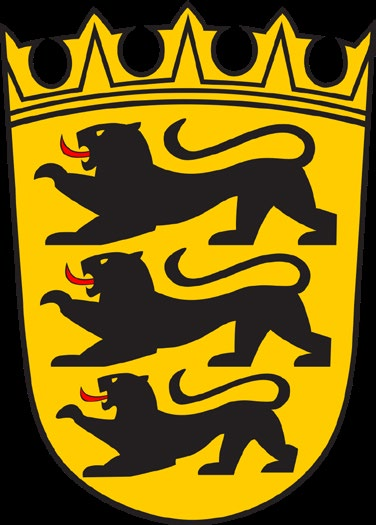
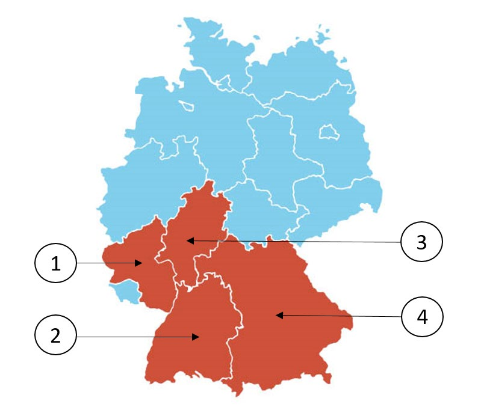

# 🗺️ State questions

‼️ In this section you only need to know the questions related to the state you are registered. ‼️

---

## **Baden-Württemberg**

---

**Aufgabe 1**

*Welches Wappen gehört zum Bundesland Baden-Württemberg?*

| Bild 1 | Bild 2 | Bild 3 | Bild 4 |
|--------|--------|--------|--------|
|  |  |  |  |

- [x] Bild 1
- [ ] Bild 2
- [ ] Bild 3
- [ ] Bild 4

---

**Aufgabe 2**

*Welches ist ein Landkreis in Baden-Württemberg?*

- [ ] Mecklenburgische Seenplatte
- [x] Neckar-Odenwald-Kreis
- [ ] Nordfriesland
- [ ] Altötting

---

**Aufgabe 3**

*Für wie viele Jahre wird der Landtag in Baden-Württemberg gewählt?*

- [ ] 3
- [ ] 4
- [x] 5
- [ ] 6

---

**Aufgabe 4**

*Ab welchem Alter darf man in Baden-Württemberg bei Kommunalwahlen wählen?*

- [ ] 14
- [x] 16
- [ ] 18
- [ ] 20

---

**Aufgabe 5**

*Welche Farben hat die Landesflagge von Baden-Württemberg?*

- [ ] blau-weiß-rot
- [x] schwarz-gold
- [ ] weiß-blau
- [ ] grün-weiß-rot

---

**Aufgabe 6**

*Wo können Sie sich in Baden-Württemberg über politische Themen informieren?*

- [ ] beim Ordnungsamt der Gemeinde
- [ ] bei der Verbraucherzentrale
- [x] bei der Landeszentrale für politische Bildung
- [ ] bei den Kirchen

---

**Aufgabe 7**

*Die Landeshauptstadt von Baden-Württemberg heißt…*

- [ ] Heidelberg.
- [x] Stuttgart.
- [ ] Karlsruhe.
- [ ] Mannheim.

---

**Aufgabe 8**

*Welches Bundesland ist Baden-Württemberg?*

- [ ] 1
- [x] 2
- [ ] 3
- [ ] 4

---

**Aufgabe 9**

*Wie nennt man die Regierungschefin/den Regierungschef in Baden-Württemberg?*

- [ ] Erste Ministerin/Erster Minister
- [ ] Premierministerin/Premierminister
- [ ] Bürgermeisterin/Bürgermeister
- [x] Ministerpräsidentin/Ministerpräsident

---

**Aufgabe 10**

*Welche Ministerin/welchen Minister hat Baden-Württemberg nicht?*

- [ ] Finanzministerin/Finanzminister
- [ ] Justizministerin/Justizminister
- [ ] Innenministerin/Innenminister
- [x] Außenministerin/Außenminister

---

## **Bayern**

---

**Aufgabe 1**

*Welches Wappen gehört zum Freistaat Bayern?*

Bild 1 Bild 2 Bild 3 Bild 4

- [ ] Bild 1
- [ ] Bild 2
- [ ] Bild 3
- [ ] Bild 4

---

**Aufgabe 2**

*Welches ist ein Landkreis in Bayern?*

- [ ] Prignitz
- [ ] Rhein-Sieg-Kreis
- [ ] Nordfriesland
- [x] Altötting

---

**Aufgabe 3**

*Für wie viele Jahre wird der Landtag in Bayern gewählt?*

- [ ] 3
- [ ] 4
- [ ] 5
- [x] 6

---

**Aufgabe 4**

*Ab welchem Alter darf man in Bayern bei Kommunalwahlen wählen?*

- [ ] 14
- [ ] 16
- [x] 18
- [ ] 20

---

**Aufgabe 5**

*Welche Farben hat die Landesflagge von Bayern?*

- [ ] blau-weiß-rot
- [x ] weiß-blau
- [ ] grün-weiß-rot
- [ ] schwarz-gelb

---

**Aufgabe 6**

*Wo können Sie sich in Bayern über politische Themen informieren?*

- [ ] beim Ordnungsamt der Gemeinde
- [x] bei der Landeszentrale für politische Bildung
- [ ] bei der Verbraucherzentrale
- [ ] bei den Kirchen

---

**Aufgabe 7**

*Die Landeshauptstadt von Bayern heißt…*

- [ ] Ingolstadt.
- [ ] Regensburg.
- [ ] Nürnberg.
- [x] München.

---

**Aufgabe 8**

*Welches Bundesland ist Bayern?*

- [ ] 1
- [ ] 2
- [ ] 3
- [ ] 4

---

**Aufgabe 9**

*Wie nennt man die Regierungschefin/den Regierungschef in Bayern?*

- [ ] Erste Ministerin/Erster Minister
- [ ] Premierministerin/Premierminister
- [ ] Bürgermeisterin/Bürgermeister
- [x] Ministerpräsidentin/Ministerpräsident

---

**Aufgabe 10**

*Welche Mi nister in/welchen Minister hat Bayern nicht?*

- [ ] Justizministerin/Justizminister
- [x] Außenministerin/Außenminister
- [ ] Finanzministerin/Finanzminister
- [ ] Innenministerin/Innenminister

---

## **Berlin**

---

**Aufgabe 1**

*Welches Wappen gehört zum Bundesland Berlin?*

Bild 1 Bild 2 Bild 3 Bild 4

- [ ] Bild 1
- [ ] Bild 2
- [ ] Bild 3
- [ ] Bild 4

---

**Aufgabe 2**

*Welches ist ein Bezirk von Berlin?*

- [ ] Altona
- [ ] Prignitz
- [x] Pankow
- [ ] Mecklenburgische Seenplatte

---

**Aufgabe 3**

*Für wie viele Jahre wird das Landesparlament in Berlin gewählt?*

- [ ] 3
- [ ] 4
- [x] 5
- [ ] 6

---

**Aufgabe 4**

*Ab welchem Alter darf man in Berlin bei Kommunalwahlen (Wahl der*
*Bezirksverordnetenversammlung) wählen?*

- [ ] 14
- [x] 16
- [ ] 18
- [ ] 20

---

**Aufgabe 5**

*Welche Farben hat die Landesflagge von Berlin?*

- [ ] blau-weiß-rot
- [x] weiß-rot
- [ ] grün-weiß-rot
- [ ] schwarz-gold

---

**Aufgabe 6**

*Wo können Sie sich in Berlin über politische Themen informieren?*

- [ ] beim Ordnungsamt der Gemeinde
- [ ] bei den Kirchen
- [ ] bei der Verbraucherzentrale
- [x] bei der Landeszentrale für politische Bildung

---

**Aufgabe 7**

*Welches Bundesland ist ein Stadtstaat?*

- [x] Berlin
- [ ] Saarland
- [ ] Brandenb urg
- [ ] Hessen

---

**Aufgabe 8**

*Welches Bundesland ist Berlin?*

- [ ] 1
- [ ] 2
- [ ] 3
- [ ] 4

---

**Aufgabe 9**

*Wie nennt man die Regierungschefin/den Regierungschef des Stadtstaates Berlin?*

- [ ] Ministerpräsidentin/Ministerpräsident
- [ ] Oberbürgermeisterin/Oberbürgermeister
- [ ] Präsidentin/Präsident des Senates
- [x] Regierende Bürgermeisterin/Regierender Bürgermeister

---

**Aufgabe 10**

*Welche Senator in/ welchen Senator hat Berlin nicht?*

- [ ] Finanzsenatorin/Finanzsenator
- [ ] Innensenatorin/Innensenator
- [x] Senatorin/Senator für Außenbeziehungen
- [ ] Justizsenatorin/Justizsenator

---

## **Brandenburg**

---

**Aufgabe 1**

*Welches Wappen gehört zum Bundesland Brandenburg?*

Bild 1 Bild 2 Bild 3 Bild 4

- [ ] Bild 1
- [ ] Bild 2
- [ ] Bild 3
- [ ] Bild 4

---

**Aufgabe 2**

*Welches ist ein Landkreis in Brandenburg?*

- [x] Prignitz
- [ ] Rhein-Sieg-Kreis
- [ ] Vogtlandkreis
- [ ] Amberg-Sulzbach

---

**Aufgabe 3**

*Für wie viele Jahre wird der Landtag in Brandenburg gewählt?*

- [ ] 3
- [ ] 4
- [x] 5
- [ ] 6

---

**Aufgabe 4**

*Ab welchem Alter darf man in Brandenburg bei Kommunalwahlen wählen?*

- [ ] 14
- [x] 16
- [ ] 18
- [ ] 20

---

**Aufgabe 5**

*Welche Farben hat die Landesflagge von Brandenburg?*

- [ ] blau-weiß-rot
- [x] rot-weiß
- [ ] grün-weiß-rot
- [ ] schwarz-gelb

---

**Aufgabe 6**

*Wo können Sie sich in Brandenburg über politische Themen informieren?*

- [ ] bei den Kirchen
- [ ] beim Ordnungsamt der Gemeinde
- [x] bei der Landeszentrale für politische Bildung
- [ ] bei der Verbraucherzentrale

---

**Aufgabe 7**

*Die Landeshauptstadt von Brandenburg heißt…*

- [x] Potsdam.
- [ ] Cottbus.
- [ ] Brandenburg.
- [ ] Frankfurt/Oder.

---

**Aufgabe 8**

*Welches Bundesland ist Brandenburg?*

- [ ] 1
- [ ] 2
- [ ] 3
- [ ] 4

---

**Aufgabe 9**

*Wie nennt man die Regierungschefin/den Regierungschef in Brandenburg?*

- [ ] Erste Ministerin/Erster Minister
- [ ] Premierministerin/Premierminister
- [ ] Bürgermeisterin/Bürgermeister
- [x] Ministerpräsidentin/Ministerpräsident

---

**Aufgabe 10**

*Welche Ministerin/welchen Minister hat Brandenburg nicht?*

- [ ] Justizministerin/Justizminister
- [x] Außenministerin/Außenminister
- [ ] Finanzministerin/Finanzminister
- [ ] Innenministerin/Innenminister

---

## **Bremen**

---

**Aufgabe 1**

*Welches Wappen gehört zur Freien Hansestadt Bremen?*

Bild 1 Bild 2 Bild 3 Bild 4

- [ ] Bild 1
- [ ] Bild 2
- [ ] Bild 3
- [ ] Bild 4

---

**Aufgabe 2**

*Welches ist ein Stadtteil von Bremen?*

- [ ] Altona
- [x] Hemelingen
- [ ] Pankow
- [ ] Babelsberg

---

**Aufgabe 3**

*Für wie viele Jahre wird das Landesparlament in Bremen gewählt?*

- [ ] 3
- [x] 4
- [ ] 5
- [ ] 6

---

**Aufgabe 4**

*Ab welchem Alter darf man in Bremen bei den Wahlen zur Bürgerschaft (Landtag) wählen?*

- [ ] 14
- [x] 16
- [ ] 18
- [ ] 20

---

**Aufgabe 5**

*Welche Farben hat die Landesflagge von Bremen?*

- [ ] blau-weiß-rot
- [x] rot-weiß
- [ ] grün-weiß-rot
- [ ] schwarz-gold

---

**Aufgabe 6**

*Wo können Sie sich in Bremen über politische Themen informieren?*

- [ ] beim Ordnungsamt der Gemeinde
- [x] bei der Landeszentrale für politische Bildung
- [ ] bei den Kirchen
- [ ] bei der Verbraucherzentrale

---

**Aufgabe 7**

*Was ist ein deutscher Stadtstaat?*

- [x] Bremen
- [ ] München
- [ ] Frankfurt
- [ ] Erfurt

---

**Aufgabe 8**

*Welches Bundesland ist Bremen?*

- [ ] 1
- [ ] 2
- [ ] 3
- [ ] 4

---

**Aufgabe 9**

*Wie nennt man die Regierungschefin/den Regierungschef des Stadtstaates Bremen?*

- [ ] Ministerpräsidentin/Ministerpräsident
- [x] Erste Bürgermeisterin/Erster Bürgermeister
- [ ] Präsidentin/Präsident des Senates
- [ ] Regierende Bürgermeisterin/Regierender Bürgermeister

---

**Aufgabe 10**

*Welche Senator in/ welchen Senator hat Bremen nicht?*

- [x] Senatorin/Senator für Außenbeziehungen
- [ ] Finanzsenatorin/Finanzsenator
- [ ] Justizsenatorin/Justizsenator
- [ ] Innensenatorin/Innensenator

---

## **Hamburg**

---

**Aufgabe 1**

*Welches Wappen gehört zur Freien und Hansestadt Hamburg?*

Bild 1 Bild 2 Bild 3 Bild 4

- [ ] Bild 1
- [ ] Bild 2
- [ ] Bild 3
- [ ] Bild 4

---

**Aufgabe 2**

*Welches ist ein Bezirk von Hamburg?*

- [x] Altona
- [ ] Hemelingen
- [ ] Pankow
- [ ] Mecklenburgische Seenplatte

---

**Aufgabe 3**

*Für wie viele Jahre wird das Landesparlament in Hamburg gewählt?*

- [ ] 3
- [ ] 4
- [x] 5
- [ ] 6

---

**Aufgabe 4**

*Ab welchem Alter darf man in Hamburg bei Kommunalwahlen (Wahl der Bezirksversammlungen) wählen?*

- [ ] 14
- [x] 16
- [ ] 18
- [ ] 20

---

**Aufgabe 5**

*Welche Farben hat die Landesflagge von Hamburg?*

- [ ] blau-weiß-rot
- [x] weiß-rot
- [ ] grün-weiß-rot
- [ ] schwarz-gelb

---

**Aufgabe 6**

*Wo können Sie sich in Hamburg über politische Themen informieren?*

- [ ] beim Ordnungsamt der Gemeinde
- [ ] bei der Verbraucherzentrale
- [ ] bei den Kirchen
- [x] bei der Landeszentrale für politische Bildung

---

**Aufgabe 7**

*Welches Bundesland ist ein Stadtstaat?*

- [x] Hamburg
- [ ] Sachsen
- [ ] Bayer n
- [ ] Thüringen

---

**Aufgabe 8**

*Welches Bundesland ist Hamburg?*

- [ ] 1
- [ ] 2
- [ ] 3
- [ ] 4

---

**Aufgabe 9**

*Wie nennt man die Regierungschefin/den Regierungschef des Stadtstaates Hamburg?*

- [ ] Ministerpräsidentin/Ministerpräsident
- [x] Erste Bürgermeisterin/Erster Bürgermeister
- [ ] Regierende Senatorin /Regierender Senator
- [ ] Oberbürgermeisterin/Oberbürgermeister

---

**Aufgabe 10**

*Welche Senator in/ welchen Senator hat Hamburg nicht?*

- [ ] Justizsenatorin/Justizsenator
- [x] Senatorin/Senator für Außenbeziehungen
- [ ] Finanzsenatorin/Finanzsenator
- [ ] Innensenatorin/Innensenator

---

## **Hessen**

---

**Aufgabe 1**

*Welches Wappen gehört zum Bundesland Hessen?*

Bild 1 Bild 2 Bild 3 Bild 4

- [ ] Bild 1
- [ ] Bild 2
- [ ] Bild 3
- [ ] Bild 4

---

**Aufgabe 2**

*Welches ist ein Landkreis in Hessen?*

- [ ] Ammerland
- [ ] Altötting
- [ ] Prignitz
- [x] Main-Taunus-Kreis

---

**Aufgabe 3**

*Für wie viele Jahre wird der Landtag in Hessen gewählt?*

- [ ] 3
- [ ] 4
- [x] 5
- [ ] 6

---

**Aufgabe 4**

*Ab welchem Alter darf man in Hessen bei Kommunalwahlen wählen?*

- [ ] 14
- [x] 16
- [ ] 18
- [ ] 20

---

**Aufgabe 5**

*Welche Farben hat die Landesflagge von Hessen?*

- [ ] blau-weiß-rot
- [x] rot-weiß
- [ ] schwarz-gold
- [ ] grün-weiß-rot

---

**Aufgabe 6**

*Wo können Sie sich in Hessen über politische Themen informieren?*

- [x] bei der Landeszentrale für politische Bildung
- [ ] bei der Verbraucherzentrale
- [ ] beim Ordnungsamt der Gemeinde
- [ ] bei den Kirchen

---

**Aufgabe 7**

*Die Landeshauptstadt von Hessen heißt…*

- [ ] Kassel.
- [ ] Darmstadt.
- [ ] Frankfurt.
- [x] Wiesbaden.

---

**Aufgabe 8**

*Welches Bundesland ist Hessen?*

- [ ] 1
- [ ] 2
- [ ] 3
- [ ] 4

---

**Aufgabe 9**

*Wie nennt man die Regierungschefin/den Regierungschef in Hessen?*

- [ ] Erste Ministerin/Erster Minister
- [ ] Premierministerin/Premierminister
- [ ] Bürgermeisterin/Bürgermeister
- [x] Ministerpräsidentin/Ministerpräsident

---

**Aufgabe 10**

*Welche Ministerin/welchen Minister hat Hessen nicht?*

- [ ] Justizministerin/Justizminister
- [x] Außenministerin/Außenminister
- [ ] Finanzministerin/Finanzminister
- [ ] Innenministerin/Innenminister

---

## **Mecklenburg-Vorpommern**

---

**Aufgabe 1**

*Welches Wappen gehört zum Bundesland Mecklenburg-Vorpommern?*

Bild 1 Bild 2 Bild 3 Bild 4

- [ ] Bild 1
- [ ] Bild 2
- [ ] Bild 3
- [ ] Bild 4

---

**Aufgabe 2**

*Welches ist ein Landkreis in Mecklenburg-Vorpommern?*

- [ ] Prignitz
- [x] Mecklenburgische Seenplatte
- [ ] Vogtlandkreis
- [ ] Rhein-Sieg-Kreis

---

**Aufgabe 3**

*Für wie viele Jahre wird der Landtag in Mecklenburg-Vorpommern gewählt?*

- [ ] 3
- [ ] 4
- [ ] 5
- [x] 6

---

**Aufgabe 4**

*Ab welchem Alter darf man in Mecklenburg-Vorpommern bei Kommunalwahlen wählen?*

- [ ] 14
- [x] 16
- [ ] 18
- [ ] 20

---

**Aufgabe 5**

*Welche Farben hat die Landesflagge von Mecklenburg-Vorpommern?*

- [ ] schwarz-rot-gold
- [x] blau-weiß-gelb-rot
- [ ] grün-weiß-rot
- [ ] schwarz-gelb

---

**Aufgabe 6**

*Wo können Sie sich in Mecklenburg-Vorpommern über politische Themen informieren?*

- [x] bei der Landeszentrale für politische Bildung
- [ ] bei den Kirchen
- [ ] beim Ordnungsamt der Gemeinde
- [ ] bei der Verbraucherzentrale

---

**Aufgabe 7**

*Die Landeshauptstadt von Mecklenburg-Vorpommern heißt…*

- [ ] Greifswald.
- [x] Schwerin.
- [ ] Rostock.
- [ ] Wismar.

---

**Aufgabe 8**

*Welches Bundesland ist Mecklenburg-Vorpommern?*

- [ ] 1
- [ ] 2
- [ ] 3
- [ ] 4

---

**Aufgabe 9**

*Wie nennt man die Regierungschefin/den Regierungschef in Mecklenburg-Vorpommern?*

- [ ] Erste Ministerin/Erster Minister
- [ ] Premierministerin/Premierminister
- [ ] Bürgermeisterin/Bürgermeister
- [x] Ministerpräsidentin/Ministerpräsident

---

**Aufgabe 10**

*Welche Ministerin/welchen Minister hat Mecklenburg-Vorpommern nicht?*

- [ ] Justizministerin/Justizminister
- [x] Außenministerin/Außenminister
- [ ] Finanzministerin/Finanzminister
- [ ] Innenministerin/Innenminister

---

## **Niedersachsen**

---

**Aufgabe 1**

*Welches Wappen gehört zum Bundesland Niedersachsen?*

Bild 1 Bild 2 Bild 3 Bild 4

- [ ] Bild 1
- [ ] Bild 2
- [ ] Bild 3
- [ ] Bild 4

---

**Aufgabe 2**

*Welches ist ein Landkreis in Niedersachsen?*

- [x] Ammerland
- [ ] Rhein-Sieg-Kreis
- [ ] Nordfriesland
- [ ] Vogtlandkreis

---

**Aufgabe 3**

*Für wie viele Jahre wird der Landtag in Niedersachsen gewählt?*

- [ ] 3
- [ ] 4
- [x] 5
- [ ] 6

---

**Aufgabe 4**

*Ab welchem Alter darf man in Niedersachsen bei Kommunalwahlen wählen?*

- [ ] 14
- [x] 16
- [ ] 18
- [ ] 20

---

**Aufgabe 5**

*Welche Farben hat die Landesflagge von Niedersachsen?*

- [ ] weiß-blau
- [x] schwarz-rot-gold
- [ ] schwarz-gelb
- [ ] blau-weiß-rot

---

**Aufgabe 6**

*Wo können Sie sich in Niedersachsen über politische Themen informieren?*

- [x] bei der Landeszentrale für politische Bildung
- [ ] beim Ordnungsamt der Gemeinde
- [ ] bei der Verbraucherzentrale
- [ ] bei den Kirchen

---

**Aufgabe 7**

*Die Landeshauptstadt von Niedersachsen heißt…*

- [x] Hannover.
- [ ] Braunschweig.
- [ ] Wolfsburg.
- [ ] Osnabrück.

---

**Aufgabe 8**

*Welches Bundesland ist Niedersachsen?*

- [ ] 1
- [ ] 2
- [ ] 3
- [ ] 4

---

**Aufgabe 9**

*Wie nennt man die Regierungschefin/den Regierungschef in Niedersachsen?*

- [ ] Erste Ministerin/Erster Minister
- [ ] Premierministerin/Premierminister
- [ ] Bürgermeisterin/Bürgermeister
- [x] Ministerpräsidentin/Ministerpräsident

---

**Aufgabe 10**

*Welche Ministerin/welchen Minister hat Niedersachsen nicht?*

- [ ] Justizministerin/Justizminister
- [x] Außenministerin/Außenminister
- [ ] Finanzministerin/Finanzminister
- [ ] Innenministerin/Innenminister

---

## **Nordrhein-Westfalen**

---

**Aufgabe 1**

*Welches Wappen gehört zum Bundesland Nordrhein-Westfalen?*

Bild 1 Bild 2 Bild 3 Bild 4

- [ ] Bild 1
- [ ] Bild 2
- [ ] Bild 3
- [ ] Bild 4

---

**Aufgabe 2**

*Welches ist ein Landkreis in Nordrhein-Westfalen?*

- [ ] Ammerland
- [x] Rhein-Sieg-Kreis
- [ ] Nordfriesland
- [ ] Vogtlandkreis

---

**Aufgabe 3**

*Für wie viele Jahre wird der Landtag in Nordrhein-Westfalen gewählt?*

- [ ] 3
- [ ] 4
- [x] 5
- [ ] 6

---

**Aufgabe 4**

*Ab welchem Alter darf man in Nordrhein-Westfalen bei Kommunalwahlen wählen?*

- [ ] 14
- [x] 16
- [ ] 18
- [ ] 20

---

**Aufgabe 5**

*Welche Farben hat die Landesflagge von Nordrhein-Westfalen?*

- [ ] rot-weiß
- [x] grün-weiß-rot
- [ ] schwarz-gold
- [ ] blau-weiß-rot

---

**Aufgabe 6**

*Wo können Sie sich in Nordrhein-Westfalen über politische Themen informieren?*

- [ ] bei den Kirchen
- [ ] beim Ordnungsamt der Gemeinde
- [ ] bei der Verbraucherzentrale
- [x] bei der Landeszentrale für politische Bildung

---

**Aufgabe 7**

*Die Landeshauptstadt von Nordrhein-Westfalen heißt…*

- [ ] Köln.
- [ ] Bonn.
- [x] Düsseldorf.
- [ ] Dortmund.

---

**Aufgabe 8**

*Welches Bundesland ist Nordrhein-Westfalen?*

- [ ] 1
- [ ] 2
- [ ] 3
- [ ] 4

---

**Aufgabe 9**

*Wie nennt man die Regierungschefin/den Regierungschef in Nordrhein-Westfalen?*

- [ ] Erste Ministerin/Erster Minister
- [ ] Premierministerin/Premierminister
- [ ] Bürgermeisterin/Bürgermeister
- [x] Ministerpräsidentin/Ministerpräsident

---

**Aufgabe 10**

*Welche Ministerin/welchen Minister hat Nordrhein-Westfalen nicht?*

- [ ] Justizministerin/Justizminister
- [x] Außenministerin/Außenminister
- [ ] Finanzministerin/Finanzminister
- [ ] Innenministerin/Innenminister

---

## **Rheinland-Pfalz**

---

**Aufgabe 1**

*Welches Wappen gehört zum Bundesland Rheinland-Pfalz?*

Bild 1 Bild 2 Bild 3 Bild 4

- [ ] Bild 1
- [ ] Bild 2
- [ ] Bild 3
- [ ] Bild 4

---

**Aufgabe 2**

*Welches ist ein Landkreis in Rheinland-Pfalz?*

- [x] Westerwaldkreis
- [ ] Altötting
- [ ] Emsland
- [ ] Prignitz

---

**Aufgabe 3**

*Für wie viele Jahre wird der Landtag in Rheinland-Pfalz gewählt?*

- [ ] 3
- [ ] 4
- [x] 5
- [ ] 6

---

**Aufgabe 4**

*Ab welchem Alter darf man in Rheinland-Pfalz bei Kommunalwahlen wählen?*

- [ ] 14
- [ ] 16
- [x] 18
- [ ] 20

---

**Aufgabe 5**

*Welche Farben hat die Landesflagge von R heinland-Pfalz?*

- [ ] weiß-rot
- [x] schwarz-rot-gold
- [ ] schwarz-gelb
- [ ] grün-weiß-rot

---

**Aufgabe 6**

*Wo können Sie sich in Rheinland-Pfalz über politische Themen informieren?*

- [ ] bei den Kirchen
- [ ] bei der Verbraucherzentrale
- [ ] beim Ordnungsamt der Gemeinde
- [x] bei der Landeszentrale für politische Bildung

---

**Aufgabe 7**

*Die Landeshauptstadt von Rheinland-Pfalz heißt…*

- [x] Mainz.
- [ ] Kaiserslautern.
- [ ] Ludwigshafen.
- [ ] Koblenz.

---

**Aufgabe 8**

*Welches Bundesland ist Rheinland-Pfalz?*

- [ ] 1
- [ ] 2
- [ ] 3
- [ ] 4

---

**Aufgabe 9**

*Wie nennt man die Regierungschefin/den Regierungschef in Rheinland-Pfalz?*

- [ ] Erste Ministerin/Erster Minister
- [ ] Premierministerin/Premierminister
- [ ] Bürgermeisterin/Bürgermeister
- [x] Ministerpräsidentin/Ministerpräsident

---

**Aufgabe 10**

*Welche Ministerin/welchen Minister hat Rheinland-Pfalz nicht?*

- [ ] Justizministerin/Justizminister
- [x] Außenministerin/Außenminister
- [ ] Finanzministerin/Finanzminister
- [ ] Innenministerin/Innenminister

---

## **Saarland**

---

**Aufgabe 1**

*Welches Wappen gehört zum Bundesland Saarland?*

Bild 1 Bild 2 Bild 3 Bild 4

- [ ] Bild 1
- [ ] Bild 2
- [ ] Bild 3
- [ ] Bild 4

---

**Aufgabe 2**

*Welches ist ein Landkreis im Saarland?*

- [ ] Mecklenburgische Seenplatte
- [ ] Altötting
- [x] Neunkirchen
- [ ] Rhein-Sieg-Kreis

---

**Aufgabe 3**

*Für wie viele Jahre wird der Landtag des Saarlandes gewählt?*

- [ ] 3
- [ ] 4
- [x ] 5
- [ ] 6

---

**Aufgabe 4**

*Ab welchem Alter darf man im Saarland bei Kommunalwahlen wählen?*

- [ ] 14
- [ ] 16
- [x ] 18
- [ ] 20

---

**Aufgabe 5**

*Welche Farben hat die Landesflagge des Saarlandes?*

- [ ] weiß-blau
- [x] schwarz-rot-gold
- [ ] schwarz-gelb
- [ ] grün-weiß-rot

---

**Aufgabe 6**

*Wo können Sie sich im Saarland über politische Themen informieren?*

- [ ] bei den Kirchen
- [x] bei der Landeszentrale für politische Bildung
- [ ] bei der Verbraucherzentrale
- [ ] beim Ordnungsamt der Gemeinde

---

**Aufgabe 7**

*Die Landeshauptstadt des Saarlandes heißt…*

- [ ] Neunkirchen.
- [ ] Homburg.
- [x] Saarbrücken.
- [ ] Völklingen.

---

**Aufgabe 8**

*Welches Bundesland ist das Saarland?*

- [ ] 1
- [ ] 2
- [ ] 3
- [ ] 4

---

**Aufgabe 9**

*Wie nennt man die Regierungschefin/den Regierungschef des Saarlandes?*

- [ ] Erste Ministerin/Erster Minister
- [ ] Premierministerin/Premierminister
- [ ] Bürgermeisterin/Bürgermeister
- [x] Ministerpräsidentin/Ministerpräsident

---

**Aufgabe 10**

*Welche Mi nister in/welchen Minister hat das Saarland nicht?*

- [ ] Justizministerin/Justizminister
- [x] Außenministerin/Außenminister
- [ ] Finanzministerin/Finanzminister
- [ ] Innenministerin/Innenminister

---

## **Sachsen**

---

**Aufgabe 1**

*Welches Wappen gehört zum Freistaat Sachsen?*

Bild 1 Bild 2 Bild 3 Bild 4

- [ ] Bild 1
- [ ] Bild 2
- [ ] Bild 3
- [ ] Bild 4

---

**Aufgabe 2**

*Welches ist ein Landkreis in Sachsen?*

- [x] Vogtlandkreis
- [ ] Altötting
- [ ] Uckermark
- [ ] Nordfriesland

---

**Aufgabe 3**

*Für wie viele Jahre wird der Landtag in Sachsen gewählt?*

- [ ] 3
- [ ] 4
- [x] 5
- [ ] 6

---

**Aufgabe 4**

*Ab welchem Alter darf man in Sachsen bei Kommunalwahlen wählen?*

- [ ] 14
- [ ] 16
- [x ] 18
- [ ] 20

---

**Aufgabe 5**

*Welche Farben hat die Landesflagge von Sachsen?*

- [ ] blau-weiß-rot
- [x] weiß-grün
- [ ] grün-weiß-rot
- [ ] schwarz-gelb

---

**Aufgabe 6**

*Wo können Sie sich in Sachsen über politische Themen informieren?*

- [x] bei der Landeszentrale für politische Bildung
- [ ] beim Ordnungsamt der Gemeinde
- [ ] bei den Kirchen
- [ ] bei der Verbraucherzentrale

---

**Aufgabe 7**

*Die Landeshauptstadt von Sachsen heißt…*

- [ ] Leipzig.
- [x] Dresden.
- [ ] Chemnitz.
- [ ] Zwickau.

---

**Aufgabe 8**

*Welches Bundesla nd ist Sachsen?*

- [ ] 1
- [ ] 2
- [ ] 3
- [ ] 4

---

**Aufgabe 9**

*Wie nennt man die Regierungschefin/den Regierungschef in Sachsen?*

- [ ] Erste Ministerin/Erster Minister
- [ ] Premierministerin/Premierminister
- [ ] Bürgermeisterin/Bürgermeister
- [x] Ministerpräsidentin/Ministerpräsident

---

**Aufgabe 10**

*Welche Mi nister in/welchen Minister hat Sachsen nicht?*

- [ ] Justizministerin/Justizminister
- [x] Außenministerin/Außenminister
- [ ] Finanzministerin/Finanzminister
- [ ] Innenministerin/Innenminister

---

## **Sachsen-Anhalt**

---

**Aufgabe 1**

*Welches Wappen gehört zum Bundesland Sachsen-Anhalt?*

Bild 1 Bild 2 Bild 3 Bild 4

- [ ] Bild 1
- [ ] Bild 2
- [ ] Bild 3
- [ ] Bild 4

---

**Aufgabe 2**

*Welches ist ein Landkreis in Sachsen-Anhalt?*

- [ ] Ammerland
- [ ] Altötting
- [ ] Uckermark
- [x] Börde

---

**Aufgabe 3**

*Für wie viele Jahre wird der Landtag in Sachsen-Anhalt gewählt?*

- [ ] 3
- [ ] 4
- [x] 5
- [ ] 6

---

**Aufgabe 4**

*Ab welchem Alter darf man in Sachsen-Anhalt bei Kommunalwahlen wählen?*

- [ ] 14
- [x] 16
- [ ] 18
- [ ] 20

---

**Aufgabe 5**

*Welche Farben hat die Landesflagge von Sachsen-Anhalt?*

- [ ] blau-weiß-rot
- [x] gelb-schwarz
- [ ] grün-weiß-rot
- [ ] weiß-rot

---

**Aufgabe 6**

*Wo können Sie sich in Sachsen-Anhalt über politische Themen informieren?*

- [ ] bei den Kirchen
- [x] bei der Landeszentrale für politische Bildung
- [ ] beim Ordnungsamt der Gemeinde
- [ ] bei der Verbraucherzentrale

---

**Aufgabe 7**

*Die Landeshauptstadt von Sachsen-Anhalt heißt…*

- [ ] Halle.
- [ ] Dessau.
- [x] Magdeburg .
- [ ] Wittenberg.

---

**Aufgabe 8**

*Welches Bundesland ist Sachsen-Anhalt?*

- [ ] 1
- [ ] 2
- [ ] 3
- [ ] 4

---

**Aufgabe 9**

*Wie nennt man die Regierungschefin/den Regierungschef in Sachsen-Anhalt?*

- [ ] Erste Ministerin/Erster Minister
- [ ] Premierministerin/Premierminister
- [ ] Bürgermeisterin/Bürgermeister
- [x] Ministerpräsidentin/Ministerpräsident

---

**Aufgabe 10**

*Welche Ministerin/welchen Minister hat Sachsen-Anhalt nicht?*

- [ ] Justizministerin/Justizminister
- [x] Außenministerin/Außenminister
- [ ] Finanzministerin/Finanzminister
- [ ] Innenministerin/Innenminister

---

## **Schleswig-Holstein**

---

**Aufgabe 1**

*Welches Wappen gehört zum Bundesland Schleswig-Holstein?*

Bild 1 Bild 2 Bild 3 Bild 4

- [ ] Bild 1
- [ ] Bild 2
- [ ] Bild 3
- [ ] Bild 4

---

**Aufgabe 2**

*Welches ist ein Landkreis in Schleswig-Holstein?*

- [ ] Ammerland
- [ ] Mecklenburgische Seenplatte
- [x] Nordfriesland
- [ ] Rhein-Sieg-Kreis

---

**Aufgabe 3**

*Für wie viele Jahre wird der Landtag in Schleswig-Holstein gewählt?*

- [ ] 3
- [ ] 4
- [x] 5
- [ ] 6

---

**Aufgabe 4**

*Ab welchem Alter darf man in Schleswig-Holstein bei Kommunalwahlen wählen?*

- [ ] 14
- [x] 16
- [ ] 18
- [ ] 20

---

**Aufgabe 5**

*Welche Farben hat die Landesflagge von Schleswig-Holstein?*

- [ ] weiß-blau
- [x] blau-weiß-rot
- [ ] weiß-rot
- [ ] grün-weiß-rot

---

**Aufgabe 6**

*Wo können Sie sich in Schleswig-Holstein über politische Themen informieren?*

- [ ] bei der Verbraucherzentrale
- [ ] beim Ordnungsamt der Gemeinde
- [x] beim / bei der Landesbeauftragten für politische Bildung
- [ ] bei den Kirchen

---

**Aufgabe 7**

*Die Landeshauptstadt von Schleswig-Holstein heißt…*

- [ ] Husum.
- [ ] Flensburg.
- [ ] Lübeck.
- [x] Kiel.

---

**Aufgabe 8**

*Welches Bundesland ist Schleswig-Holstein?*

- [ ] 1
- [ ] 2
- [ ] 3
- [ ] 4

---

**Aufgabe 9**

*Wie nennt man die Regierungschefin/den Regierungschef in Schleswig-Holstein?*

- [ ] Erste Ministerin/Erster Minister
- [ ] Premierministerin/Premierminister
- [ ] Bürgermeisterin/Bürgermeister
- [x] Ministerpräsidentin/Ministerpräsident

---

**Aufgabe 10**

*Welche Ministerin/welchen Minister hat Schleswig-Holstein nicht?*

- [ ] Justizministerin/Justizminister
- [x] Außenministerin/Außenminister
- [ ] Finanzministerin/Finanzminister
- [ ] Innenministerin/Innenminister

---

## **Thüringen**

---

**Aufgabe 1**

*Welches Wappen gehört zum Freistaat Thüringen?*

Bild 1 Bild 2 Bild 3 Bild 4

- [ ] Bild 1
- [ ] Bild 2
- [ ] Bild 3
- [ ] Bild 4

---

**Aufgabe 2**

*Welches ist ein Landkreis in Thüringen?*

- [ ] Ammerland
- [ ] Altötting
- [ ] Nordfriesland
- [x] Wartburgkreis

---

**Aufgabe 3**

*Für wie viele Jahre wird der Landtag in Thüringen gewählt?*

- [ ] 3
- [ ] 4
- [x] 5
- [ ] 6

---

**Aufgabe 4**

*Ab welchem Alter darf man in Thüringen bei Kommunalwahlen wählen?*

- [ ] 14
- [x] 16
- [ ] 18
- [ ] 20

---

**Aufgabe 5**

*Welche Farben hat die Landesflagge von Thüringen?*

- [ ] blau-weiß-rot
- [x] weiß-rot
- [ ] grün-weiß-rot
- [ ] schwarz-gold

---

**Aufgabe 6**

*Wo können Sie sich in Thüringen über politische Themen informieren?*

- [ ] bei den Kirchen
- [ ] bei der Verbraucherzentrale
- [x] bei der Landeszentrale für politische Bildung
- [ ] beim Ordnungsamt der Gemeinde

---

**Aufgabe 7**

*Die Landeshauptstadt von Thüringen heißt…*

- [ ] Eisenach.
- [x] Erfurt.
- [ ] Gera.
- [ ] Jena.

---

**Aufgabe 8**

*Welches Bundesland ist Thüringen?*

- [ ] 1
- [ ] 2
- [ ] 3
- [ ] 4

---

**Aufgabe 9**

*Wie nennt man die Regierungschefin/den Regierungschef in Thüringen?*

- [ ] Erste Ministerin/Erster Minister
- [ ] Premierministerin/Premierminister
- [ ] Bürgermeisterin/Bürgermeister
- [x] Ministerpräsidentin/Ministerpräsident

---

**Aufgabe 10**

*Welche Ministerin/welchen Minister hat Thüringen nicht?*

- [ ] Justizministerin/Justizminister
- [x] Außenministerin/Außenminister
- [ ] Finanzministerin/Finanzminister
- [ ] Innenministerin/Innenminister

---