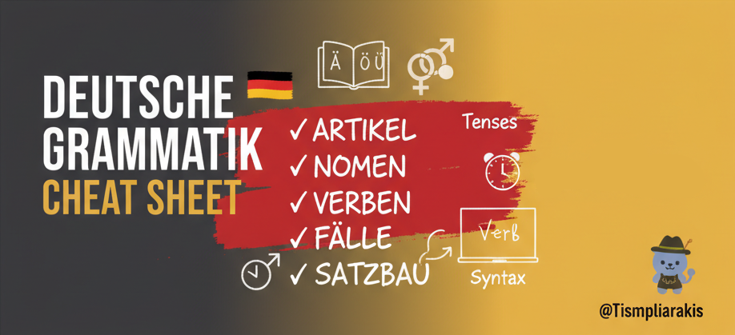

# 📖 Grammar (Grammatik)

---

---

Welcome to the structured roadmap for mastering German grammar! This overview connects all major topics and allows you to quickly jump to any subcategory, from beginner concepts to advanced syntax.

---

## 📑 [Articles (Artikel)](./articles/README.md)

Articles define the **gender**, **number**, and **case** of nouns and are fundamental to the German language.

| Subcategory | Description |
| --- | --- |
| [**Definite**](./articles/definite.md) | The 'der, die, das' articles and their full declension table. |
| [**Indefinite**](./articles/indefinite.md) | The 'ein, eine, ein' articles and their declension. 
| [**Negative**](./articles/negative.md) | The negative article 'kein' and its usage. |
| [**No article**](./articles/no-article.md) | Rules for when no article is used (e.g., with materials, professions). |

---

## 📝 [Nouns (Nomen)](./nouns/README.md)

The German noun system is complex due to gender, plural, and case.

| Subcategory | Description |
| --- | --- |
| [**Cases**](./nouns/cases.md) | Detailed breakdown of Nominativ, Akkusativ, Dativ, and Genitiv function. |
| [**Declension**](./nouns/declension.md) | Noun declension rules, including the weak N-Declension. |
| [**Gender**](./nouns/gender.md) | Tips and rules for remembering the grammatical gender (der/die/das). |
| [**Plurals**](./nouns/plurals.md) | The five main categories of German plural formation. |

---

## 🏃 [Verbs (Verben)](./verbs/README.md)

The core of German sentence structure, covering action and time.

| Subcategory | Description |
| --- | --- |
| [**Conjugation**](./verbs/conjugation.md) | Rules for regular (weak) verb conjugation in the present tense. |
| [**Irregular verbs**](./verbs/irregular-verbs.md) | Common strong and mixed verbs and their changes across tenses. |
| [**Modal verbs**](./verbs/modal-verbs.md) | *können, müssen, dürfen, sollen, wollen, mögen* and their syntax. |
| [**Passive voice**](./verbs/passive-voice.md) | Forming the passive voice in various tenses (using *werden*). |
| [**Tenses**](./verbs/tenses.md) | Overview of Präsens, Perfekt, Präteritum, Plusquamperfekt, Futur I & II. |

---

## 🎨 [Adjectives (Adjektive)](./adjectives/README.md)

Rules for describing nouns and creating comparisons.

| Subcategory | Description |
| --- | --- |
| [**Declension**](./adjectives/declension.md) | The comprehensive rules for weak, mixed, and strong adjective endings. |
| [**Comparison**](./adjectives/comparison.md) | Comparative and superlative forms (*schnell, schneller, am schnellsten*). |
| [**Endings**](./adjectives/adjective-endings.md) | Quick reference for the correct adjective endings based on the preceding article/pronoun. |

---

## 🙋 [Pronouns (Pronomen)](./pronouns/README.md)

Words that replace nouns, varying by person, number, and case.

| Subcategory | Description |
| --- | --- |
| [**Demonstrative**](./pronouns/demonstrative.md) | Pointing pronouns like *dieser, jener* (this one, that one). |
| [**Personal**](./pronouns/personal.md) | Subject and object pronouns for all persons (ich, du, er, etc.). |
| [**Possessive**](./pronouns/possessive.md) | Pronouns showing ownership (*mein, dein, sein*, etc.). |
| [**Reflexive**](./pronouns/reflexive.md) | Pronouns used with reflexive verbs (*mich, dich, sich*). |
| [**Relative**](./pronouns/relative.md) | Pronouns used to introduce relative clauses (*der, die, das, welcher*). |

---

## 🏗️ [Syntax (Satzbau)](./syntax/README.md)

How sentences are constructed, covering word order and clause types.

| Subcategory | Description |
| --- | --- |
| [**Main clauses**](./syntax/main-clauses.md) | The standard structure of simple German statements (V2 rule). |
| [**Negation**](./syntax/negation.md) | Placement and usage of *nicht* and *kein*. |
| [**Questions**](./syntax/questions.md) | Forming Yes/No questions and W-questions. |
| [**Subordinate clauses**](./syntax/subordinate-clauses.md) | Rules for dependent clauses: verb at the end (*dass, weil, obwohl*). |
| [**Word order**](./syntax/word-order.md) | The rules for placing sentence elements (Time, Manner, Place - TeKaMoLo). |

---

## 🎲 [Miscellany (Verschiedenes)](./miscellany/README.md)

Includes topics that don't fit neatly into the main categories, such as conjunctions and particles.

| Topic | Description |
| --- | --- |
| [**Prepositions**](./miscellany/prepositions.md) | Rules for Dativ, Akkusativ, and Two-Way prepositions. |
| [**Conjunctions**](./miscellany/conjunctions.md) | Coordinating (*und, aber, oder*) and subordinating conjunctions. |
| [**Particles**](./miscellany/particles.md) | Common German filler words (*doch, halt, mal*) and their functions. |

---

> ## 💡 **Tips**
>
> - **Consistency beats intensity**: 10 minutes of grammar practice every day is better than 3 hours once a month.  
> - **Learn patterns, not exceptions**: German loves rules with exceptions, but focusing on the patterns makes the exceptions easier to remember.  
> - **Case awareness**: Always ask yourself: *Who is doing what to whom?* That mental question helps you spot the right case.  
> - **Articles are your compass**: Pay close attention to *der, die, das*. They tell you almost everything about gender, case, and number.  
> - **Practice in context**: Don’t just memorize tables—use sentences, short dialogues, or your own examples.  
> - **Mistakes are fuel**: If you never mess up, you’re not pushing yourself. Germans will still understand you if you swap *dem* and *den*—you just sound like a tourist.  
> - **Shadowing works**: Repeat out loud what you hear from natives (YouTube, podcasts, etc.) to internalize grammar without memorizing.  
> - **Grammar + [Vocabulary](../vocabulary/README.md) = Power**: Grammar is structure, but without words it’s an empty skeleton. Learn them together.  

---